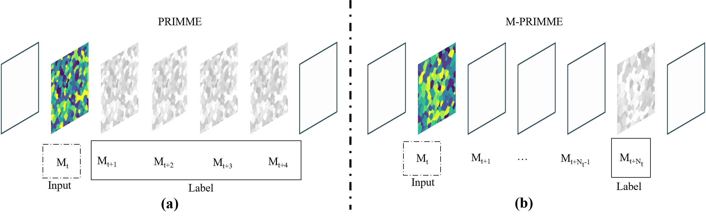
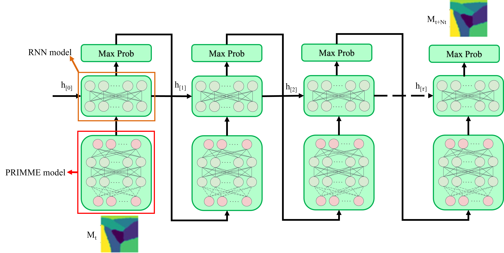
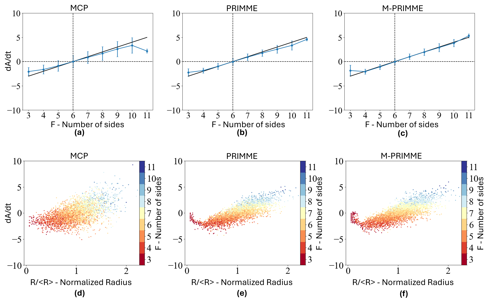

# M-PRIMME
## Introduction
Predicting grain growth dynamics is essential for understanding and controlling microstructural evolution in materials. The novel Physics-Regularized Interpretable Machine Learning Microstructure Evolution (PRIMME) model has been shown to accurately predict 2D isotropic grain growth, but requires training on five consecutive grain structures, making it impractical training from experimental data.

To address this limitation, we introduce *multi-step PRIMME* (**M-PRIMME**) that requires only two non-adjacent grain structures, reducing the amount of required training data by two-thirds. 

**M-PRIMME** predicts grain growth by learning the probability of site-wise grain transitions rather than directly predicting future grain structures. It incorporates interfacial energy regularization to enforce physical consistency and employs a recurrent neural network to enable multi-step predictions from non-adjacent grain structure observations. 

Trained using Monte Carlo Potts simulations, **M-PRIMME** effectively captures 2D normal grain growth and outperforms PRIMME in several examples. Additionally, **M-PRIMME** allows for tunable grain growth rate predictions. 

The model’s effectiveness is demonstrated through geometric and topological analyses, including validation against the von Neumann-Mullins relationship, confirming its robustness for grain evolution prediction with significantly reduced data requirements.

## Results

    

**Figure 1** The difference in training data between PRIMME and M-PRIMME. In PRIMME, each training batch consists of
five consecutive measurements: the first $(M_t)$ serves as the input, while the remaining four $(M_{t+1}, M_{t+2}, M_{t+3}, M_{t+4})$ are
used to compute the label information, as shown in part(a). In M-PRIMME, each batch consists of two non-consecutive
measurements, with the first ($M_t$) as the input and the second for $(M_{t+Nt})$ label calculation, as shown in part (b).

    

**Figure 2**  (a) The input for the M-PRIMME is the interfacial
energy for each site, calculated using the same methodology as implemented in the PRIMME model30. The current polycrystal
grain (measurement $M_t$ in this diagram) is treated as the first input to the M-PRIMME. Subsequently, the output of the
PRIMME module serves as the input for the RNN module. The RNN module generates an action likelihood map, guiding how
the grain at the current measurement evolves into the next grain. (b) The predicted grain becomes the input for the subsequent
M-PRIMME prediction. In this diagram, this process is reiterated $N_\tau$ times to forecast the $N_{t+Nt}$ time polycrystal grain.

    

**Figure 3** Input and output of the M-PRIMME model. Based on polycrystalline grain observations (part a), interfacial
boundary energies are computed (part b). The interfacial energy of a central pixel and its neighboring sites (with a 17 $\times$ 17
region) serves as the input for M-PRIMME (part c). This local internal energy map is used to train M-PRIMME, which outputs
an action likelihood map (within a 17 $\times$ 17 region). In this map, the site with the highest action likelihood (marked with "B")
determines the new grain number of the central site (marked with A, shown in part e). The corresponding local region (within a 17 $\times$ 17 region) in the original structure is depicted in part (f).

    

**Figure 4** Evolution of a circular grain with a radius of 64μm within a 256 $\times$ 256 pixel matrix. (a) Visual representations of
the diminishing circular grain as simulated by MCP, PRIMME, and M-PRIMME methods. The temporal progression in MCP,
PRIMME, and M-PRIMME simulations has been temporally adjusted to a real-time scale by fitting it to the analytical solution
presented in Eq. 5. (b) The temporal evolution of the circular grain’s area in MCP, PRIMME, and M-PRIMME simulations.
Additionally, as a reference, the analytical solution provided by Eq. 5 is also depicted, marked with a dashed line.

    

**Figure 5** Evaluation of the evolution of polycrystalline grains within a 512 $\times$ 512 pixel domain, commencing with an initial
count of 512 grains, through the employment of MCP, PRIMME, and M-PRIMME. The method of prediction, the grain count
(around 512, 300, 150, and 50 grains) in the image, and the step count utilized to achieve the current grain count in the image
are denoted in the title of each corresponding subplot.

    

**Figure 6** Geometric and topological investigation within a 1024 $\times$ 1024 pixel region, featuring an initial population of 4,096
grains, as computed by MCP, PRIMME, and M-PRIMME: (a) Change in the average grain area (average squared grain size)
over time; (b) Change in the number of grains with time; (c) Change in the average number of sides per grain with time. (d) and
(e) The grain size and number of sides distributions, respectively, for approximately 3000, 2000, and 1000 grains.

    

**Figure 7** Comparison of the behavior predicted by MCP, PRIMME, and M-PRIMME with the von Neumann-Mullins
relationship from the 1024 $\times$ 1024 polycrystal with 4,096 in initial grains. Parts (a), (b), and (c) show the change in the grain
area versus number of sides. The black line shows the relationship from Eq. (5), the blue line the average relationship from the
simulations, and the error bars the standard deviation of the change in grain area. Similarly, parts (d), (e), and (f) illustrate the
relationship between the change in grain area with time and the normalized grain, where the color of the points indicate the
number of sides of the grains.

    

**Figure 8** The impact of batch size $N$ and measurement interval $N_i$ on the prediction by M-PRIMME of the evolution of
circular grains within a 256 $\times$ 256 pixel domain with an initial radius of 64 pixels. The images show the circular grain after
approximately 40 seconds. The values of $N$ and $N_i$ used to train the model are indicated for each image. Each subplot title also
includes the grain count change ratio between paired grain structures.

    

**Figure 9** The impact of batch size $N$ and measurement interval $N_i$ on the prediction by M-PRIMME of the evolution of
polycrystalline grains within a 512 $\times$ 512 pixel domain, initially containing 512 grains. The images show the polycrystal
structure after approximately 60 seconds. The values of $N$ and $N_i$ used to train the model are indicated for each image. Each
subplot title also includes the grain count change ratio between paired grain structures.

    

**Figure 10** The impact of the measurement interval $N_t$ and number of measurement pairs $N$ on the linearity of the predicted
change in grain area with time, as evaluated by the coefficient of determination ($\Re^2$). The closer $\Re^2$ is to 1, the more linear the change in area with time. Results come from M-PRIMME simulations of a 1024 $\times$ 1024 polycrystal containing 4,096 initial
grains.

    

**Figure 11** The impact of $N_t \neq N_\tau$ on the performance of M-PRIMME. We model circular grain within a 256 $\times$ 256 pixel
domain with an initial 64-pixel radius. During training, $N_t$ = 4 and $N_\tau$ is varied from 1 to 16. Part (a) presents the circular grain
prediction produced by M-PRIMME after 100 evolution steps. Part (b) illustrates changes in the circular grain’s area evolution
as the interaction step Nτ varies from 1 to 16, with each case clearly labeled in the legend.